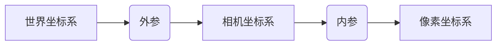
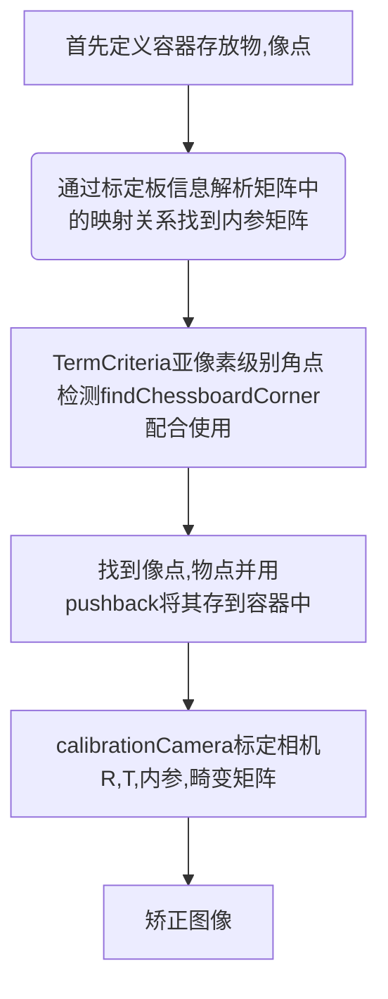

# calibration# 单目标定
## 镜头成像原理 

世界坐标系(w): 参考坐标系/基准坐标系，用于描述摄像机和物体的位置 

相机坐标系(c)：固定在摄像机上，原点在光心，Zc轴沿光轴方向， Xc、Yc轴分别平行于成像平面 与世界坐标系存在平移、旋转的对应关系

以物理单位表示的图像坐标系 (x, y): 原点在摄像机光轴与图像平面的交点，x、y轴与摄像机Xc、Yc轴平行，沿图像平面方向 

以像素为单位表示的图像坐标系 (u, v): 原点在数字图像的左上角，u、v轴沿图像平面向右向下为正方向

外参数矩阵：描述现实世界点A(World_Cord)怎样通过旋转、平移落在另一个现实世界点B(Camera_Cord)上。

内参数矩阵：描述点B怎样经过摄像机镜头，并通过小孔成像 进行电子化变成像素点C，鱼眼相机除外(允许畸变)

畸变矩阵：描述点C因为偏移、变形不在理论计算位置上的原因

$\mathbf{X_c}=(x_c, y_c, z_c, 1)^{\top}$，像点在图像坐标系中的齐次坐标记为 $\mathbf{m}=(x, y, 1)^{\top}$ 焦距f，小孔成像遵循相似三角形原理，则有：

$$\left\{\begin{array}{l}x=\frac{f x_c}{z_c} \\ y=\frac{f y_c}{z_c}\end{array}\right.$$

即：

$$z_c m=\left(\begin{array}{c}f_x \\ f_y \\ 1\end{array}\right)=\left(\begin{array}{llll}f & 0 & 0 & 0 \\ 0 & f & 0 & 0 \\ 0 & 0 & 1 & 0\end{array}\right) X_c$$

## Work-flow

## 鱼眼镜头

|   投影模型   |       投影函数        |                     特征                      |
| :----------: | :-------------------: | :-------------------------------------------: |
|  i 透视投影  |      r=f $\tanθ$      |                 针孔相机模型                  |
| ii 体视投影  | r=2f $tan\frac{θ}{2}$ |     任何直线相交的角度，在变换后保持不变      |
| iii 等距投影 |         r=fθ          | 物体成像面上距离画面中心的距离与入射角成正比  |
| iv 等积投影  | r=2f $sin\frac{θ}{2}$ |     在变换前后，物体所占的立体角大小不变      |
|  v 正交投影  |      r=f$\sinθ$       | 投影畸变最大，而且最大视角不能大于$180^\circ$ |

## 鱼眼镜头畸变矫正
-----------------------
### 1 棋盘格标定 

K 3x3 矩阵

D 4x1 齐次矩阵

桶形畸变进行矫正：

+ 直线矫正效果佳

+ 损失像素，靠近外围区域会被拉伸严重，视觉效果变差，只保留原图中间区域。

+ 不可以通过remap再回到鱼眼原图

  
### 2 横向展开法

利用鱼眼相机视野大的特点来进行变形：

+ 切片拼接，可以改变视角
+ 拼接结果，与真实世界产生误差（直线不能贯通，不能进行下一步语义分割任务）
+ 不会损失像素，展开图可以通过remap回到鱼眼原图
  
### 3 双经纬度法

鱼眼镜头模拟成地球坐标系，沿着经度维度矫正：
+ 插值方式，消耗大量算力资源
+ 没有像素损失，也不需要标定，人为设计规则求解remap即可

### 小结 
不损失像素？
算力支持插值？

### OpenCv 鱼眼矫正涉及函数

fisheye::calibrate() 标定鱼眼相机内参K，畸变因子D
fisheye.estimateNewCameraMatrixForUndistortRectify 考虑缩放比例、相机旋转R，如果不旋转R为单位矩阵。得到新的相机内参。 一般情况下，相机是固定的。

### fisheye::initUndistortRectifyMap()
得到上述逆矩阵iR、梯形矩阵、柱坐标点(u0, v0)、焦距(fx, fy)以及畸变参数后，反向映射，遍历目标图像所有像素位置，找到畸变图像中对应位置坐标(u, v)，并分别保存坐标(u, v)到mapx和mapy中。手写，需要参数k1, k2（径向畸变）, p1, p2（切向畸变）。其余用不到的设置为0，tauX、 tauY是梯形畸变，用不到的话设为单位矩阵。iR 投影参数矩阵Ar 和旋转矩阵乘积的逆矩阵。

通过tauX, tauY计算倾斜图像传感器的梯形畸变矩阵matTilt，其中tauX, tauY用不到的话，matTil为单位矩阵
cv::Matx33d matTilt = cv::Matx33d::eye();
cv::detail::computeTiltProjectionMatrix(tauX, tauY, &matTilt);

## remap()
根据fisheye::initUndistortRectifyMap()的结果map1, map2，反映射回去到需要去畸变的图像中，用双线插值的办法

## Reference
-----------------------
论文总结： https://blog.csdn.net/qq_16137569/article/details/112398976

鱼眼镜头模型 J. Kannala and S. S. Brandt, "A generic camera model and calibration method for conventional, wide-angle, and fish-eye lenses," in IEEE Transactions on Pattern Analysis and Machine Intelligence, vol. 28, no. 8, pp. 1335-1340, Aug. 2006, doi: 10.1109/TPAMI.2006.153.

正常图片鱼眼转换工具：[GitHub - leofansq/Tools_KITTI2FishEye: Rebuild the Fisheye dataset from the normal dataset. (Based on KITTI dataset)](https://github.com/leofansq/Tools_KITTI2FishEye)

鱼眼镜头下的语义分割： Blott, G., Takami, M., & Heipke, C. (2018). Semantic Segmentation of Fisheye Images. ECCV Workshops.

自适应亚像素细化的广角镜头标定：TartanCalib: Iterative Wide-Angle Lens Calibration using Adaptive SubPixel Refinement of AprilTags
TartanCalib: https://github.com/castacks/tartancalib

